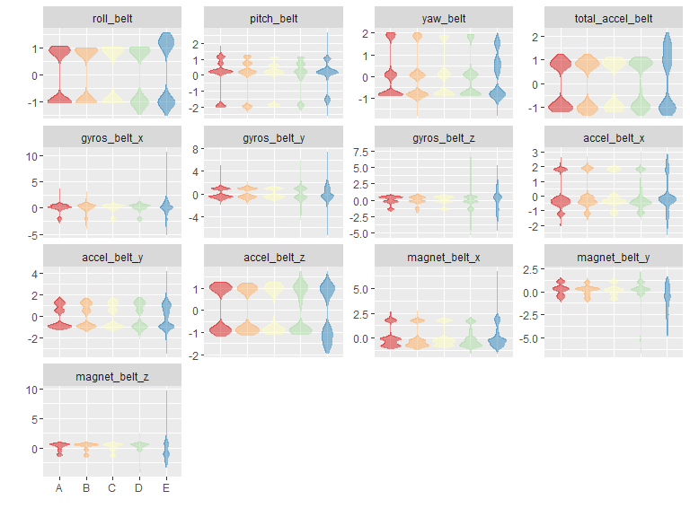
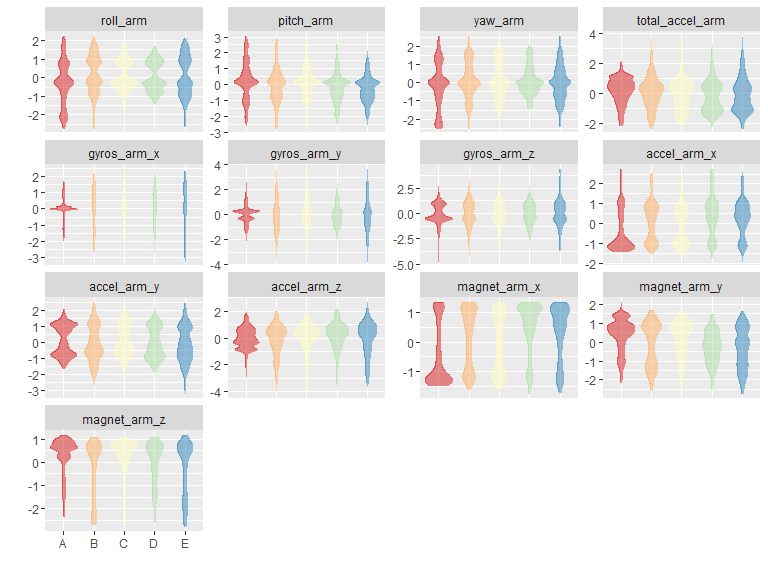
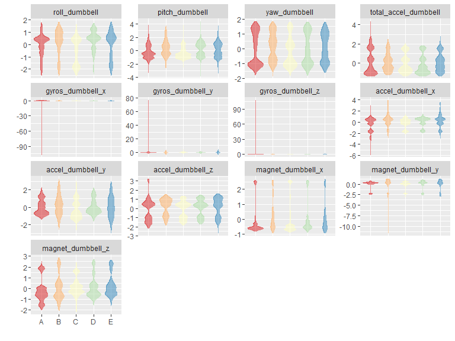
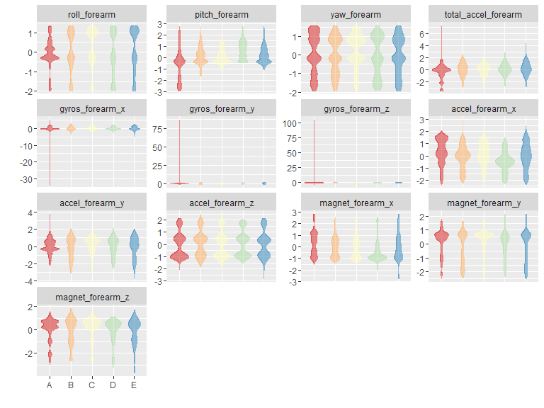

# Practical Machine Learning Project
Ribery77  
5 January 2016  


###1.Intriduction

**Background**

Using devices such as Jawbone Up, Nike FuelBand, and Fitbit it is now possible to collect a large amount of data about personal activity relatively inexpensively. These type of devices are part of the quantified self movement – a group of enthusiasts who take measurements about themselves regularly to improve their health, to find patterns in their behavior, or because they are tech geeks. One thing that people regularly do is quantify how much of a particular activity they do, but they rarely quantify how well they do it. In this project, your goal will be to use data from accelerometers on the belt, forearm, arm, and dumbell of 6 participants. They were asked to perform barbell lifts correctly and incorrectly in 5 different ways. More information is available from the website here: http://groupware.les.inf.puc-rio.br/har (see the section on the Weight Lifting Exercise Dataset).


**Data**

The training data for this project are available here: https://d396qusza40orc.cloudfront.net/predmachlearn/pml-training.csv

The test data are available here: https://d396qusza40orc.cloudfront.net/predmachlearn/pml-testing.csv

The data for this project come from this source: http://groupware.les.inf.puc-rio.br/har. If you use the document you create for this class for any purpose please cite them as they have been very generous in allowing their data to be used for this kind of assignment.

**Task**

What you should submit

The goal of your project is to predict the manner in which they did the exercise. This is the "classe" variable in the training set. You may use any of the other variables to predict with. You should create a report describing how you built your model, how you used cross validation, what you think the expected out of sample error is, and why you made the choices you did. You will also use your prediction model to predict 20 different test cases.


```r
rm(list = ls(all = TRUE))
# Set WD
setwd("C:\\RBook\\Practical Machine Learning\\Project")
```


###2.Clean the data and made a preprocessing.

Read the training data into a data table.


```r
library(data.table)

# Set the connection to internet and load the dataset.
setInternet2(TRUE)
url <- "https://d396qusza40orc.cloudfront.net/predmachlearn/pml-training.csv"
D <- fread(url)
```


Read the testing data into a data table.

```r
url <- "https://d396qusza40orc.cloudfront.net/predmachlearn/pml-testing.csv"
DTest <- fread(url)
```


We need to find in our test dataset which variable have zero NAs.

Belt, arm, dumbbell, and forearm variables that do not have any missing values in the test dataset will be **predictor candidates**.


```r
isAnyMissing <- sapply(DTest, function (x) any(is.na(x) | x == ""))
isPredictor <- !isAnyMissing & grepl("belt|[^(fore)]arm|dumbbell|forearm", names(isAnyMissing))
predCandidates <- names(isAnyMissing)[isPredictor]
predCandidates
```

```
##  [1] "roll_belt"            "pitch_belt"           "yaw_belt"            
##  [4] "total_accel_belt"     "gyros_belt_x"         "gyros_belt_y"        
##  [7] "gyros_belt_z"         "accel_belt_x"         "accel_belt_y"        
## [10] "accel_belt_z"         "magnet_belt_x"        "magnet_belt_y"       
## [13] "magnet_belt_z"        "roll_arm"             "pitch_arm"           
## [16] "yaw_arm"              "total_accel_arm"      "gyros_arm_x"         
## [19] "gyros_arm_y"          "gyros_arm_z"          "accel_arm_x"         
## [22] "accel_arm_y"          "accel_arm_z"          "magnet_arm_x"        
## [25] "magnet_arm_y"         "magnet_arm_z"         "roll_dumbbell"       
## [28] "pitch_dumbbell"       "yaw_dumbbell"         "total_accel_dumbbell"
## [31] "gyros_dumbbell_x"     "gyros_dumbbell_y"     "gyros_dumbbell_z"    
## [34] "accel_dumbbell_x"     "accel_dumbbell_y"     "accel_dumbbell_z"    
## [37] "magnet_dumbbell_x"    "magnet_dumbbell_y"    "magnet_dumbbell_z"   
## [40] "roll_forearm"         "pitch_forearm"        "yaw_forearm"         
## [43] "total_accel_forearm"  "gyros_forearm_x"      "gyros_forearm_y"     
## [46] "gyros_forearm_z"      "accel_forearm_x"      "accel_forearm_y"     
## [49] "accel_forearm_z"      "magnet_forearm_x"     "magnet_forearm_y"    
## [52] "magnet_forearm_z"
```


Bear in mind that intinial dataset we need to include only the **predictor candidates** and the outcome variable, *classe*.


```r
varToInclude <- c("classe", predCandidates)
D <- D[, varToInclude, with=FALSE]
dim(D)
```

```
## [1] 19622    53
```


```r
names(D)
```

```
##  [1] "classe"               "roll_belt"            "pitch_belt"          
##  [4] "yaw_belt"             "total_accel_belt"     "gyros_belt_x"        
##  [7] "gyros_belt_y"         "gyros_belt_z"         "accel_belt_x"        
## [10] "accel_belt_y"         "accel_belt_z"         "magnet_belt_x"       
## [13] "magnet_belt_y"        "magnet_belt_z"        "roll_arm"            
## [16] "pitch_arm"            "yaw_arm"              "total_accel_arm"     
## [19] "gyros_arm_x"          "gyros_arm_y"          "gyros_arm_z"         
## [22] "accel_arm_x"          "accel_arm_y"          "accel_arm_z"         
## [25] "magnet_arm_x"         "magnet_arm_y"         "magnet_arm_z"        
## [28] "roll_dumbbell"        "pitch_dumbbell"       "yaw_dumbbell"        
## [31] "total_accel_dumbbell" "gyros_dumbbell_x"     "gyros_dumbbell_y"    
## [34] "gyros_dumbbell_z"     "accel_dumbbell_x"     "accel_dumbbell_y"    
## [37] "accel_dumbbell_z"     "magnet_dumbbell_x"    "magnet_dumbbell_y"   
## [40] "magnet_dumbbell_z"    "roll_forearm"         "pitch_forearm"       
## [43] "yaw_forearm"          "total_accel_forearm"  "gyros_forearm_x"     
## [46] "gyros_forearm_y"      "gyros_forearm_z"      "accel_forearm_x"     
## [49] "accel_forearm_y"      "accel_forearm_z"      "magnet_forearm_x"    
## [52] "magnet_forearm_y"     "magnet_forearm_z"
```


Convert *classe* into factor type.

```r
D <- D[, classe := factor(D[, classe])]
D[, .N, classe]
```

```
##    classe    N
## 1:      A 5580
## 2:      B 3797
## 3:      C 3422
## 4:      D 3216
## 5:      E 3607
```


The next step is to split data into 60% training and 40% test dataset.


```r
library(caret)
```

```
## Loading required package: lattice
## Loading required package: ggplot2
```

```r
seed <- as.numeric(as.Date("2016-01-06"))
set.seed(seed)
#set.seed(1948)
inTrain <- createDataPartition(D$classe, p=0.6)
DTrain <- D[inTrain[[1]]]
DProbe <- D[-inTrain[[1]]]
```


Preprocess the prediction variables by centering and scaling.


```r
X <- DTrain[, predCandidates, with=FALSE]
preProc <- preProcess(X)
preProc
```

```
## Created from 11776 samples and 52 variables
## 
## Pre-processing:
##   - centered (52)
##   - ignored (0)
##   - scaled (52)
```


```r
XCS <- predict(preProc, X)
DTrainCS <- data.table(data.frame(classe = DTrain[, classe], XCS))
```


On the other hand, we need to apply our model to the centring and scalling to the test set.

```r
X <- DProbe[, predCandidates, with=FALSE]
XCS <- predict(preProc, X)
DProbeCS <- data.table(data.frame(classe = DProbe[, classe], XCS))
```


Check for near zero variance.


```r
nzv <- nearZeroVar(DTrainCS, saveMetrics=TRUE)
if (any(nzv$nzv)) nzv else message("No variables with near zero variance")
```

```
## No variables with near zero variance
```


Review groups of prediction variables.

```r
histGroup <- function (data, regex) {
  col <- grep(regex, names(data))
  col <- c(col, which(names(data) == "classe"))
  library(reshape2)
  n <- nrow(data)
  DMelted <- melt(data[, col, with=FALSE][, rownum := seq(1, n)], id.vars=c("rownum", "classe"))
  library(ggplot2)
  ggplot(DMelted, aes(x=classe, y=value)) +
    geom_violin(aes(color=classe, fill=classe), alpha=1/2) +
#     geom_jitter(aes(color=classe, fill=classe), alpha=1/10) +
#     geom_smooth(aes(group=1), method="gam", color="black", alpha=1/2, size=2) +
    facet_wrap(~ variable, scale="free_y") +
    scale_color_brewer(palette="Spectral") +
    scale_fill_brewer(palette="Spectral") +
    labs(x="", y="") +
    theme(legend.position="none")
}
histGroup(DTrainCS, "belt")
```

```
## 
## Attaching package: 'reshape2'
## 
## The following objects are masked from 'package:data.table':
## 
##     dcast, melt
```

 


```r
histGroup(DTrainCS, "[^(fore)]arm")
```

 


```r
histGroup(DTrainCS, "dumbbell")
```

 


```r
histGroup(DTrainCS, "forearm")
```

 


###3.Build a prediction model
We have to use the random forest, the out of sample error have to be small. The error will be computed using the test set sample. 

Assign the parallel clusters.


```r
library(parallel)
library(doParallel)
```

```
## Loading required package: foreach
## Loading required package: iterators
```

```r
# Assign them.
cl <- makeCluster(detectCores() - 1)
registerDoParallel(cl)
```


Set the control parameters.

```r
ctrl <- trainControl(classProbs=TRUE,
                     savePredictions=TRUE,
                     allowParallel=TRUE)
```


Fit model over the tuning parameters.


```r
method <- "rf"
system.time(trainingModel <- train(classe ~ ., data=DTrainCS, method=method))
```

```
## Loading required package: randomForest
## randomForest 4.6-12
## Type rfNews() to see new features/changes/bug fixes.
## 
## Attaching package: 'randomForest'
## 
## The following object is masked from 'package:ggplot2':
## 
##     margin
```

```
##    user  system elapsed 
##   73.51    0.59 2839.17
```


Stop the clusters.

```r
stopCluster(cl)
```


###4.Run the model on training set


```r
trainingModel
```

```
## Random Forest 
## 
## 11776 samples
##    52 predictor
##     5 classes: 'A', 'B', 'C', 'D', 'E' 
## 
## No pre-processing
## Resampling: Bootstrapped (25 reps) 
## Summary of sample sizes: 11776, 11776, 11776, 11776, 11776, 11776, ... 
## Resampling results across tuning parameters:
## 
##   mtry  Accuracy   Kappa      Accuracy SD  Kappa SD   
##    2    0.9860117  0.9823025  0.002911862  0.003682892
##   27    0.9862123  0.9825569  0.002520395  0.003191030
##   52    0.9783441  0.9726032  0.005219691  0.006606478
## 
## Accuracy was used to select the optimal model using  the largest value.
## The final value used for the model was mtry = 27.
```


```r
hat <- predict(trainingModel, DTrainCS)
confusionMatrix(hat, DTrain[, classe])
```

```
## Confusion Matrix and Statistics
## 
##           Reference
## Prediction    A    B    C    D    E
##          A 3348    0    0    0    0
##          B    0 2279    0    0    0
##          C    0    0 2054    0    0
##          D    0    0    0 1930    0
##          E    0    0    0    0 2165
## 
## Overall Statistics
##                                      
##                Accuracy : 1          
##                  95% CI : (0.9997, 1)
##     No Information Rate : 0.2843     
##     P-Value [Acc > NIR] : < 2.2e-16  
##                                      
##                   Kappa : 1          
##  Mcnemar's Test P-Value : NA         
## 
## Statistics by Class:
## 
##                      Class: A Class: B Class: C Class: D Class: E
## Sensitivity            1.0000   1.0000   1.0000   1.0000   1.0000
## Specificity            1.0000   1.0000   1.0000   1.0000   1.0000
## Pos Pred Value         1.0000   1.0000   1.0000   1.0000   1.0000
## Neg Pred Value         1.0000   1.0000   1.0000   1.0000   1.0000
## Prevalence             0.2843   0.1935   0.1744   0.1639   0.1838
## Detection Rate         0.2843   0.1935   0.1744   0.1639   0.1838
## Detection Prevalence   0.2843   0.1935   0.1744   0.1639   0.1838
## Balanced Accuracy      1.0000   1.0000   1.0000   1.0000   1.0000
```


###5.Run the model on test set


```r
hat <- predict(trainingModel, DProbeCS)
confusionMatrix(hat, DProbeCS[, classe])
```

```
## Confusion Matrix and Statistics
## 
##           Reference
## Prediction    A    B    C    D    E
##          A 2232   10    0    0    0
##          B    0 1501   17    2    0
##          C    0    6 1347   12    0
##          D    0    1    4 1270    1
##          E    0    0    0    2 1441
## 
## Overall Statistics
##                                           
##                Accuracy : 0.993           
##                  95% CI : (0.9909, 0.9947)
##     No Information Rate : 0.2845          
##     P-Value [Acc > NIR] : < 2.2e-16       
##                                           
##                   Kappa : 0.9911          
##  Mcnemar's Test P-Value : NA              
## 
## Statistics by Class:
## 
##                      Class: A Class: B Class: C Class: D Class: E
## Sensitivity            1.0000   0.9888   0.9846   0.9876   0.9993
## Specificity            0.9982   0.9970   0.9972   0.9991   0.9997
## Pos Pred Value         0.9955   0.9875   0.9868   0.9953   0.9986
## Neg Pred Value         1.0000   0.9973   0.9968   0.9976   0.9998
## Prevalence             0.2845   0.1935   0.1744   0.1639   0.1838
## Detection Rate         0.2845   0.1913   0.1717   0.1619   0.1837
## Detection Prevalence   0.2858   0.1937   0.1740   0.1626   0.1839
## Balanced Accuracy      0.9991   0.9929   0.9909   0.9933   0.9995
```


###6.Show the final model


```r
varImp(trainingModel)
```

```
## rf variable importance
## 
##   only 20 most important variables shown (out of 52)
## 
##                      Overall
## roll_belt             100.00
## pitch_forearm          60.50
## yaw_belt               56.66
## magnet_dumbbell_z      44.43
## magnet_dumbbell_y      44.37
## pitch_belt             43.07
## roll_forearm           43.01
## accel_dumbbell_y       22.72
## roll_dumbbell          17.43
## accel_forearm_x        16.59
## magnet_dumbbell_x      16.35
## magnet_belt_z          15.38
## accel_dumbbell_z       15.12
## accel_belt_z           14.44
## total_accel_dumbbell   14.02
## magnet_forearm_z       13.88
## gyros_belt_z           11.83
## magnet_belt_y          11.55
## yaw_arm                10.85
## magnet_belt_x           9.17
```


```r
trainingModel$finalModel
```

```
## 
## Call:
##  randomForest(x = x, y = y, mtry = param$mtry) 
##                Type of random forest: classification
##                      Number of trees: 500
## No. of variables tried at each split: 27
## 
##         OOB estimate of  error rate: 0.91%
## Confusion matrix:
##      A    B    C    D    E class.error
## A 3342    2    2    0    2 0.001792115
## B   20 2250    8    0    1 0.012724879
## C    0   12 2028   14    0 0.012658228
## D    0    1   29 1899    1 0.016062176
## E    1    4    3    7 2150 0.006928406
```


The predicicted error rate is less than 1%.

Export training model object for later analysis.


```r
save(trainingModel, file="trainingModel.RData")
```


###7.Predixt on test set by Jeff Leek.

Load the training model.


```r
load(file="trainingModel.RData", verbose=TRUE)
```

```
## Loading objects:
##   trainingModel
```


Get predictions and evaluate the model.


```r
DTestCS <- predict(preProc, DTest[, predCandidates, with=FALSE])
hat <- predict(trainingModel, DTestCS)
DTest <- cbind(hat , DTest)
subset(DTest, select=names(DTest)[grep("belt|[^(fore)]arm|dumbbell|forearm", names(DTest), invert=TRUE)])
```

```
##     hat V1 user_name raw_timestamp_part_1 raw_timestamp_part_2
##  1:   B  1     pedro           1323095002               868349
##  2:   A  2    jeremy           1322673067               778725
##  3:   B  3    jeremy           1322673075               342967
##  4:   A  4    adelmo           1322832789               560311
##  5:   A  5    eurico           1322489635               814776
##  6:   E  6    jeremy           1322673149               510661
##  7:   D  7    jeremy           1322673128               766645
##  8:   B  8    jeremy           1322673076                54671
##  9:   A  9  carlitos           1323084240               916313
## 10:   A 10   charles           1322837822               384285
## 11:   B 11  carlitos           1323084277                36553
## 12:   C 12    jeremy           1322673101               442731
## 13:   B 13    eurico           1322489661               298656
## 14:   A 14    jeremy           1322673043               178652
## 15:   E 15    jeremy           1322673156               550750
## 16:   E 16    eurico           1322489713               706637
## 17:   A 17     pedro           1323094971               920315
## 18:   B 18  carlitos           1323084285               176314
## 19:   B 19     pedro           1323094999               828379
## 20:   B 20    eurico           1322489658               106658
##       cvtd_timestamp new_window num_window problem_id
##  1: 05/12/2011 14:23         no         74          1
##  2: 30/11/2011 17:11         no        431          2
##  3: 30/11/2011 17:11         no        439          3
##  4: 02/12/2011 13:33         no        194          4
##  5: 28/11/2011 14:13         no        235          5
##  6: 30/11/2011 17:12         no        504          6
##  7: 30/11/2011 17:12         no        485          7
##  8: 30/11/2011 17:11         no        440          8
##  9: 05/12/2011 11:24         no        323          9
## 10: 02/12/2011 14:57         no        664         10
## 11: 05/12/2011 11:24         no        859         11
## 12: 30/11/2011 17:11         no        461         12
## 13: 28/11/2011 14:14         no        257         13
## 14: 30/11/2011 17:10         no        408         14
## 15: 30/11/2011 17:12         no        779         15
## 16: 28/11/2011 14:15         no        302         16
## 17: 05/12/2011 14:22         no         48         17
## 18: 05/12/2011 11:24         no        361         18
## 19: 05/12/2011 14:23         no         72         19
## 20: 28/11/2011 14:14         no        255         20
```


